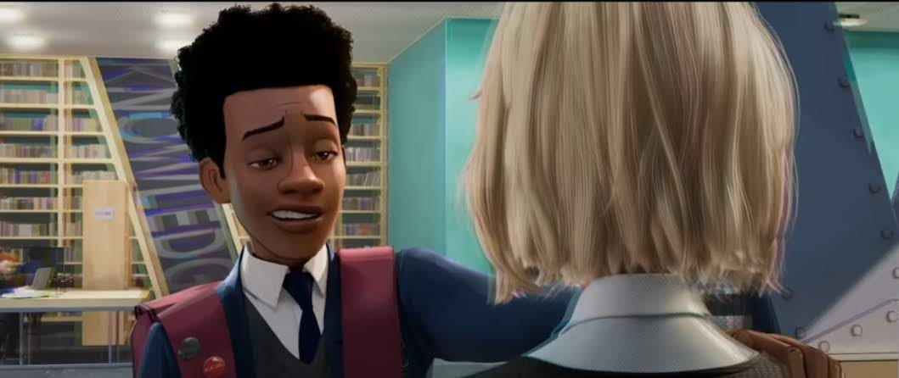

# chroma_kilter

## Motivation

The use of chromatic aberration in animation was recently explored by the critically acclaimed film *Spider-Man: Into the Spider-Verse*. In the film, the effect is used with great success as a surrogate for depth-of-field and a way to place 3D rendered scenes in the visual language of 2D comic books. Inspired by the film’s success, Chroma Kilter is an environment to explore the aesthetic uses of chromatic aberration in rendered scenes.

An example of chromatic aberration applied to Spider-Gwen

Hey.. An example of the chromatic aberration as depth-of-field

## Render modes

### Non-destructive

This mode (hotkey z) preserves the local color of rendered objects utilizing the stencil buffer. This mode is ideal for characters or critical foreground objects, granting artists more control of local colors.

### Basic

This mode (hotkey x) simply redraws the geometry on the red and blue channels with some offset parallel to the plane of the screen. The other two render modes are based on this.

### Nodepth

This mode (hotkey c) disables the depth buffer while drawing the aberrations. 

This mode is best used for background, out-of-focus objects as a substitute for depth-of-field effects. It should **not** be used in a single-pass render, but instead be used in a preliminary pass. 

## Build

Run `gradlew installDist`

Run the script `./build/install/base/bin/chroma_kilter` or `./build/install/base/bin/chroma_kilter.bat` on windows

## Use

| Keys  | Action |
|---|---|
| p  |  Pause rotation |
| i, o  |  Change rotation speed |
| k, l |  Change distance to object |
| 0-7 | Change scene |
| z,x,c | Toggle render modes (nondestructive, basic, nodepth) |
| w | Toggle wireframe |
| up, down | Increase/Decrease the displacement of the chromatic aberration |
| shift + up, shift + down | Increase/Decrease the transparency of the aberrations |
| left, right | rotate aberration axis (counterclockwise, clockwise) |
| period, slash | change distance of focal plane from screen |
| minus, equals | toggle background color |
| shift + minus, shift + equals | Change object color |